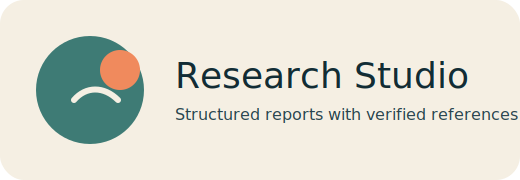

# Research Studio




Research Studio is a Flask-powered research assistant that generates long-form, structured reports with references. It uses a tool-enabled LangChain agent (Codestral via Mistral) to gather sources, produce a cohesive narrative, and export a fresh Word report for each query.

## Features
- Structured research reports (Introduction, Literature Review, Analysis/Discussion, Conclusion).
- Enforced minimum length (500+ words) with multiple paragraphs.
- At least three distinct sources, including Wikipedia.
- Clickable references in the UI.
- One-click Word report download for each run.

## Tech Stack
- Python, Flask
- LangChain + Mistral (Codestral)
- DuckDuckGo + Wikipedia tools
- python-docx for Word exports

## Setup

### 1) Create and activate a virtual environment
```bash
python3 -m venv venv
source venv/bin/activate
```

### 2) Install dependencies
```bash
pip install -r requirements.txt
```

### 3) Configure environment variables
Create a `.env` file in the project root:
```env
MISTRAL_API_KEY=your_mistral_api_key
MISTRAL_BASE_URL=https://codestral.mistral.ai/v1
```

## Run the App
```bash
python app.py
```
Open `http://127.0.0.1:5000` in your browser.

## Run the CLI
```bash
python main.py
```

## Output Files
- Word reports are saved to `reports/` as `report_YYYYMMDD_HHMMSS.docx`.
- Download links are generated per report in the UI.

## Project Structure
```
.
├── app.py
├── main.py
├── research_agent.py
├── tools.py
├── requirements.txt
├── templates/
├── static/
└── reports/
```

## Notes
- This project requires a valid Codestral/Mistral API key.
- Reports are generated fresh each run; no previous content is appended.

## Screenshots


